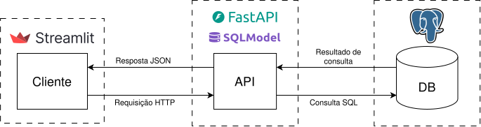

# Sistema de gestão de frota de ônibus do Distrito Federal

Este projeto implementa um sistema *web* para o gerenciamento da frota de ônibus do Distrito Federal, com funcionalidades de registro, consulta e análise de dados das empresas de transporte público, incluindo informações associadas, como itinerários, viagens, entre outros.

## Tecnologias e arquitetura
O sistema foi desenvolvido com a seguinte arquitetura e tecnologias:

*   **Interface de Usuário (Front-end):** Desenvolvida com o framework **[Streamlit](https://streamlit.io/)**.
*   **API (Back-end):** Implementada com **[FastAPI](https://fastapi.tiangolo.com/)** e a biblioteca **[SQLModel](https://sqlmodel.tiangolo.com/)** para a camada de dados.
*   **Banco de Dados:** Utiliza o SGDB **[PostgreSQL](https://www.postgresql.org/)** para gerenciamento do banco de dados.

A API atua como intermediária entre a interface do cliente e o banco de dados, conforme representado no diagrama de arquitetura abaixo.



## **Pré-requisitos**

Antes de iniciar a execução local, certifique-se de ter instalado:

*   **Python 3.12** - [Download](https://www.python.org/downloads/)
*   **Git** - [Download](https://git-scm.com/downloads)
*   **PostgreSQL 16** (ou superior) - [Download](https://www.postgresql.org/download/)
*   **pip** (gerenciador de pacotes do Python) - Geralmente incluído com Python 3.4+

## Execução em ambiente local

1. **Configure o banco de dados PostgreSQL**
   - Instale o PostgreSQL em sua máquina ([instruções de instalação](https://www.postgresql.org/download/)).
   - Certifique-se de que o serviço do PostgreSQL está em execução.

2. **Clone o repositório**
   ```bash
   git clone https://github.com/gscolombo/Projeto---BD.git
   cd Projeto---BD
3. **Configure o banco de dados**
   - Execute o script de inicialização na pasta `sql`:
   ```bash
   cd sql
   ./init.sh
   ```
   *Este script irá:*
   1. Solicitar o nome do banco de dados, o nome de usuário e a senha para conexão ao servidor do PostgreSQL.
   2. Deletar o banco de dados (caso exista).
   3. Criar o banco de dados (caso não exista).
   4. Executar os scripts SQL para criar todas as tabelas, views e procedures
   5. Popular o banco com dados iniciais.
    > **Atenção:** Utilize um usuário com permissões para criar, modificar e excluir tabelas, *views* e *procedures*.
4. **Instale as dependências**
   - Recomenda-se criar um ambiente virtual:
   ```bash
   # Na raiz do projeto
   python -m venv .venv
   
   # Ativação no Linux/macOS
   source .venv/bin/activate
   
   # Ativação no Windows (CMD)
   source .venv\Scripts\activate
   ```
   - Instale os requisitos de ambos os subsistemas:
   ```bash
   pip install -r frontend/requirements.txt
   pip install -r api/requirements.txt
   ```
5. **Inicie os serviços**
   - **API** (em um terminal):
   ```bash
   fastapi dev api/main.py
   ```
   - **Interface web** (em outro terminal):
   ```bash
   streamlit run frontend/main.py
   ```
6. **Acesse a aplicação**
   - A interface estará disponível em: `http://localhost:8501`
   - A API estará disponível em: `http://localhost:8000`

