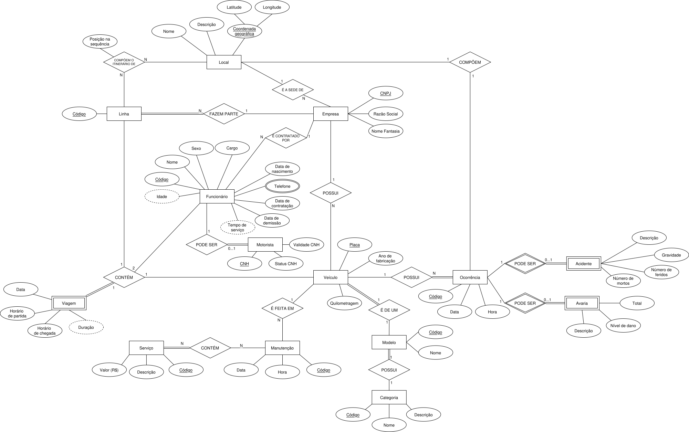
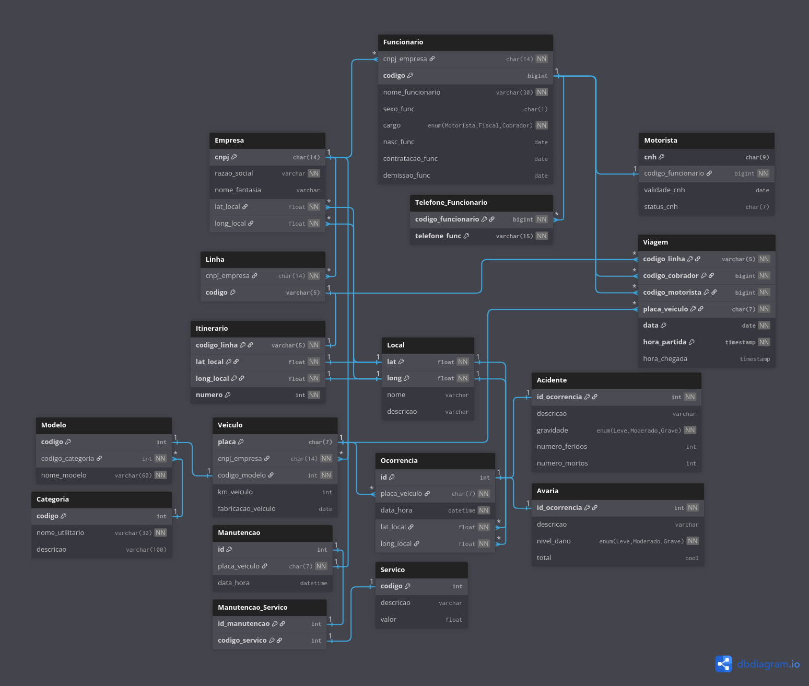

# Sistema de Gestão de Frota de Ônibus do Distrito Federal
### Bancos de Dados - 2025/2 - Universidade de Brasília
#### Integrantes:
- Gabriel de Souza Colombo - 222014062
- Eduardo de Paula Carvalho - 251039175
<br>

## Introdução
O presente projeto visa a construção de um sistema para monitoramento da frota de ônibus atuante no Distrito Federal, assim como o gerenciamento dos dados por um administrador do governo (GDF). No caso, espera-se que o produto final possibilite ao usuário tanto a visualização de um *dashboard* com informações relevantes sobre a frota do DF a partir dos dados cadastrados, assim como o registro e atualização desses dados. De maneira geral, espera-se que o sistema seja possibilite o/a:
- Registro, atualização e visualização de dados de empresas, funcionários e veículos do transporte público do DF
- Registro e monitoramento de viagens, com visualização de itinerário e outras informações associadas
- Visualização de estatísticas e informações relevantes sobre a frota de ônibus do DF.

A princípio, o sistema será desenvolvido considerando sua utilização por um único usuário, para evitar lidar com questões de autenticação presentes em um sistema multiusuário.<br>
É apresentado em seguida a especificação do sistema que auxiliou na elaboração do modelo conceitual.

#### Especificação do sistema

>O objetivo do sistema é possibilitar o gerenciamento da frota de ônibus do Distrito Federal por um administrador do governo. A frota de ônibus é fornecida por empresas de transporte público. Cada empresa é identificada por um CNPJ e possui razão social, nome fantasia, o local da sede e um ou mais funcionários, veículos e linhas de ônibus.
>
>Cada funcionário é identificado por um código e possui CPF, nome, data de nascimento, idade, data de contratação, data de demissão, tempo de serviço, sexo, um ou mais números de telefones e cargo, que deve ser um de três opções: fiscal, motorista ou cobrador. Um funcionário não pode fazer parte de mais de uma empresa ao mesmo tempo. Caso o funcionário seja um motorista, ele deve possuir um número de CNH, junto ao status e a data de validade da CNH.
>
>Um veículo faz parte de somente uma empresa e é identificado pela placa. Todo veículo possui modelo, ano de fabricação, quilometragem e 0 ou mais ocorrências identificadas e manutenções. Todo modelo possui um nome e uma categoria, que por sua vez possui um nome e descrição. Ambos são identificados por um código.\
Toda manutenção veicular possui uma data, hora e 1 ou mais serviços realizados e é identificada por um código atribuído no momento do registro da manutenção. Cada serviço de manutenção é identificado por um código e possui descrição e preço (em reais).
>
>Toda ocorrência pode ser uma avaria ou um acidente. Cada avaria possui descrição, nível de dano leve, moderado ou grave, e uma indicação se o veículo é ou não inoperante devido à avaria (*i.e.*, se é uma avaria total). Um acidente deve possuir descrição, gravidade, número de feridos e número de mortos. Toda ocorrência também deve possuir um local, data, horário e é identificada por um código atribuído no momento do registro da ocorrência.
>
>Uma linha de ônibus faz parte de somente uma empresa e é identificada por um código. Cada linha está associada a um itinerário, que consiste em um local de origem, um local de destino e uma sequência de pontos de parada, que é um local com uma posição específica na sequência. Um local possui e é identificado por uma coordenada geográfica, representada pela latitude e longitude, e pode possuir um nome e/ou descrição.
>
>Por fim, toda viagem possui um horário de partida, de chegada, tempo de duração estimado e um motorista, cobrador, linha de ônibus e veículo que fazem parte da mesma empresa. Logo, uma viagem só pode estar associada a uma empresa.

---
## Modelo Conceitual
Abaixo, é apresentado o modelo conceitual com base na especificação. O nome de relacionamentos deve ser interpretado da esquerda para a direita ou de cima para baixo, com prevalência do primeiro caso. Por exemplo, para a relação entre **Linha** e **Local**, lê-se 
```text
1 Linha compõem o itinerário de N Local
```

Buscou-se utilizar a mesma notação do livro *Fundamentals of Database Systems*, do Navathe. O programa para confecção do modelo foi o aplicativo *web* [drawio](https://www.drawio.com/).<br>
Para facilitar a visualização, a imagem também pode ser acessada pelo [navegador](https://raw.githubusercontent.com/gscolombo/Projeto---BD/refs/heads/main/drawio/conceptual_model.drawio.svg).



Um dos pontos principais do modelo acima é a relação entre **Local** e **Linha**, representada por um itinerário. Como especificado, toda linha de ônibus é um código que referencia uma sequência de pontos de parada do ônibus. Por exemplo, a linha `0.110` da viação (empresa) Piracicabana aponta somente para um itinerário, que também pode ser referenciado por outra linha de outra empresa. O itinerário em si consiste somente de de uma sequẽncia de locais, isto é, um ou mais locais ordenados. Nesse caso, para manter a generalidade da entidade **Local**, o atributo que define onde o local está posicionado na sequência foi incluído na relação entre **Local** e **Linha**, visto que só possui significado quando se refere a um itinerário.

## Modelo Relacional
Abaixo é apresentado o modelo relacional com base no modelo conceitual elaborado. Foi utilizado o aplicativo *web* [dbdiagram](https://dbdiagram.io/home/) para sua criação. Esse aplicativo também permite a geração de uma documentação para o banco de dados, que pode ser acessada [aqui](https://dbdocs.io/gscolombo404/Projeto-BD).



## Geração do banco de dados
Com base no modelo relacional elaborado, o *script* SQL abaixo foi utilizado para gerar o banco de dados. Além dos comandos para criação das tabelas, também há a criação dos tipos `ENUM` para algumas das colunas. Ao final do *script*, tambeḿ foram criados dois *triggers* para checar se os funcionários a serem cadastrados nas tabelas `Motorista` e `Viagem` possuem o cargo esperado, como definido na especificação.

https://github.com/gscolombo/Projeto---BD/blob/090541af0b5aa2a2b7361a8a4816f12c5048f003/sql/create_db.sql#L1-L225
